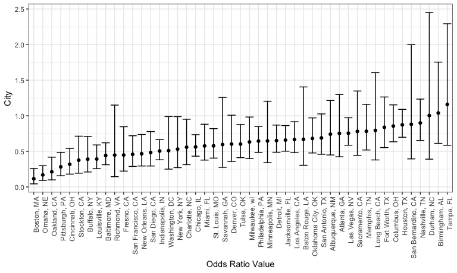

p8105\_hw6\_jl5297
================
JunLu
11/17/2018

Problem 1
---------

### a. Read and clean the data

``` r
url = "https://raw.githubusercontent.com/washingtonpost/data-homicides/master/homicide-data.csv"
homicide = GET(url) %>% content("raw") %>% read_csv
homicide_tidy = 
    homicide %>% 
    mutate(
        city_state = str_c(city, ", ", state),
        status = ifelse(disposition %in% c("Closed without arrest", "Open/No arrest"), 0, 1),
        status = as.factor(status)
           ) %>% 
    filter(!(city_state %in% c("Dallas, TX", "Phoenix, AZ", "Kansas City, MO", "Tulsa, AL"))) %>% 
    mutate(
        victim_race = ifelse(victim_race == "White", "white", "non-white"),
        victim_race = factor(victim_race, levels = c("white", "non-white")),
        victim_age = as.numeric(victim_age)
        )
str(homicide_tidy)
## Classes 'tbl_df', 'tbl' and 'data.frame':    48507 obs. of  14 variables:
##  $ uid          : chr  "Alb-000001" "Alb-000002" "Alb-000003" "Alb-000004" ...
##  $ reported_date: int  20100504 20100216 20100601 20100101 20100102 20100126 20100127 20100127 20100130 20100210 ...
##  $ victim_last  : chr  "GARCIA" "MONTOYA" "SATTERFIELD" "MENDIOLA" ...
##  $ victim_first : chr  "JUAN" "CAMERON" "VIVIANA" "CARLOS" ...
##  $ victim_race  : Factor w/ 2 levels "white","non-white": 2 2 1 2 1 1 2 2 1 2 ...
##  $ victim_age   : num  78 17 15 32 72 91 52 52 56 43 ...
##  $ victim_sex   : chr  "Male" "Male" "Female" "Male" ...
##  $ city         : chr  "Albuquerque" "Albuquerque" "Albuquerque" "Albuquerque" ...
##  $ state        : chr  "NM" "NM" "NM" "NM" ...
##  $ lat          : num  35.1 35.1 35.1 35.1 35.1 ...
##  $ lon          : num  -107 -107 -107 -107 -107 ...
##  $ disposition  : chr  "Closed without arrest" "Closed by arrest" "Closed without arrest" "Closed by arrest" ...
##  $ city_state   : chr  "Albuquerque, NM" "Albuquerque, NM" "Albuquerque, NM" "Albuquerque, NM" ...
##  $ status       : Factor w/ 2 levels "0","1": 1 2 1 2 1 1 2 2 1 1 ...
```

We load the raw data from [GitHub repository](https://github.com/washingtonpost/data-homicides). The data included the location of the killing, whether an arrest was made and, in most cases, basic demographic information about each victim.

And we clean the data by following steps:

-   Create a `city_state` variable by combining the `city` and `state`.
-   Create a binary variable indicating whether the homicide is solved.
-   Omit cities Dallas, TX; Phoenix, AZ; Kansas City, MO and Tulsa, AL.
-   Modifiy victim\_race to have categories white and non-white, with white as the reference category.
-   Transform `victim_age` into intergers and NA was introduced by coercion for unknown age.

Final dataset contains 48507 observations and 14 variables.

-   `uid`: (chr) unique identifier for each homicide record
-   `reported_date`: (int) reported date
-   `victim_last`: (chr) victim last name
-   `victim_first`: (chr) victim first name
-   `victim_race`: (Factor) victim race
-   `victim_age`: (num) victim age
-   `victim_sex`: (chr) victim sex
-   `city`: (chr) occurrence city
-   `state`: (chr) occurrence state
-   `lat`: (num) occurrence latitude
-   `lon`: (num) occurrence longitude
-   `disposition`: (chr) dispostion result(whether an arrest was made)
-   `city_state`: (chr) city and state
-   `status`: (Factor) a binary variable indicating whether the homicide is solved

### b. Fit a logistic regression for the city of Baltimore, MD

``` r
bmore_logistic = 
    homicide_tidy %>% 
    filter(city_state == "Baltimore, MD") %>% 
    glm(status ~ victim_age + victim_sex + victim_race, family = binomial(), data = .)

bmore_or = 
    bmore_logistic %>% 
    broom::tidy() %>% 
    mutate(OR = exp(estimate)) %>%
    select(term, OR)

bmore_ci = 
    bmore_logistic %>% 
    broom::confint_tidy() %>% 
    mutate(
        conf.low = exp(conf.low),
        conf.high = exp(conf.high)
    )

cbind(bmore_or, bmore_ci) %>% knitr::kable(digits = 3)
```

| term                  |     OR|  conf.low|  conf.high|
|:----------------------|------:|---------:|----------:|
| (Intercept)           |  3.274|     2.076|      5.212|
| victim\_age           |  0.993|     0.987|      0.999|
| victim\_sexMale       |  0.412|     0.315|      0.537|
| victim\_racenon-white |  0.441|     0.312|      0.620|

I use the `glm` function to fit a logistic regression with resolved vs unresolved as the outcome and victim age, sex and race (as just defined) as predictors. Then I use `broom::tidy` and `broom::confint_tidy` to get the odds ratio and the CI.

Keeping all other variables fixed，the odds ratio for solving homicides comparing non-white victims to white victims is 0.441 and the CI is (0.312, 0.620).

c. Fit logistic regressions for all city
----------------------------------------

``` r
get_or_ci = function(city_data){
    glm = glm(status ~ victim_age + victim_sex + victim_race, family = binomial(), data = city_data)
    
    or = 
    glm %>% 
    broom::tidy() %>% 
    mutate(odds_ratio = exp(estimate)) %>%
    select(term, odds_ratio)
    
    or_ci = 
    glm %>% 
    broom::confint_tidy() %>% 
    mutate(
        conf.low = exp(conf.low),
        conf.high = exp(conf.high)
    )
    
    output = cbind(or, or_ci) %>% filter(term == "victim_racenon-white") %>% select(-term)
    output
}
```

I build a function called `get_or_ci` to get the odds ratio and the CI by using `glm`, `broom::tidy` and `broom::confint_tidy`.

``` r
glm_results =
    homicide_tidy %>% 
    group_by(city_state) %>% 
    nest() %>% 
    mutate(or_ci = map(data, ~get_or_ci(.x))) %>% 
    select(-data) %>% 
    unnest() %>% 
    mutate(
        odds_ratio = round(odds_ratio, 3),
        conf.low = round(conf.low, 3),
        conf.high = round(conf.high, 3)
    )
```

Then I use `purrr::map`, list columns, `unnest` and my own function to get adjusted odds ratio (and CI) for solving homicides comparing non-white victims to white victims for each city.

``` r
glm_results %>% 
    mutate(city_state = fct_reorder(city_state, odds_ratio)) %>% 
    ggplot(aes(x = city_state, y = odds_ratio)) + 
    geom_point() + 
    geom_errorbar(aes(ymin = conf.low, ymax = conf.high)) + 
    theme(axis.text.x = element_text(angle = 90, hjust = 1)) +
    labs(
        x = "Odds Ratio Value",
        y = "City"
    )
```



I create a plot that shows the estimated ORs and CIs for each city. Most of cities have odds ratio below 1, which indicates there is a bias against non-white victims. Noticeably, the adjusted odds ratio of Boston is the lowest.

Problem 2
---------

### a. Read and clean the data

``` r
birth_weight = 
    read_csv("./data/birthweight.csv") %>% 
    mutate(
        babysex = as.factor(babysex),
        frace = as.factor(frace),
        malform = as.factor(malform),
        mrace = as.factor(mrace)
    )
```

The `birth_weight` dataset consists of roughly 4000 children and includes the following variables:

-   `babysex`: baby’s sex (male = 1, female = 2)
-   `bhead`: baby’s head circumference at birth (centimeters)
-   `blength`: baby’s length at birth (centimeteres)
-   `bwt`: baby’s birth weight (grams)
-   `delwt`: mother’s weight at delivery (pounds)
-   `fincome`: family monthly income (in hundreds, rounded)
-   `frace`: father’s race (1= White, 2 = Black, 3 = Asian, 4 = Puerto Rican, 8 = Other, 9 = Unknown)
-   `gaweeks`: gestational age in weeks
-   `malform`: presence of malformations that could affect weight (0 = absent, 1 = present)
-   `menarche`: mother’s age at menarche (years)
-   `mheigth`: mother’s height (inches)
-   `momage`: mother’s age at delivery (years)
-   `mrace`: mother’s race (1= White, 2 = Black, 3 = Asian, 4 = Puerto Rican, 8 = Other)
-   `parity`: number of live births prior to this pregnancy
-   `pnumlbw`: previous number of low birth weight babies
-   `pnumgsa`: number of prior small for gestational age babies
-   `ppbmi`: mother’s pre-pregnancy BMI
-   `ppwt`: mother’s pre-pregnancy weight (pounds)
-   `smoken`: average number of cigarettes smoked per day during pregnancy
-   `wtgain`: mother’s weight gain during pregnancy (pounds)

### b. Model selection

``` r
mult.fit <- lm(bwt ~ ., data = birth_weight)
step(mult.fit, direction = 'backward')
## Start:  AIC=48717.83
## bwt ~ babysex + bhead + blength + delwt + fincome + frace + gaweeks + 
##     malform + menarche + mheight + momage + mrace + parity + 
##     pnumlbw + pnumsga + ppbmi + ppwt + smoken + wtgain
## 
## 
## Step:  AIC=48717.83
## bwt ~ babysex + bhead + blength + delwt + fincome + frace + gaweeks + 
##     malform + menarche + mheight + momage + mrace + parity + 
##     pnumlbw + pnumsga + ppbmi + ppwt + smoken
## 
## 
## Step:  AIC=48717.83
## bwt ~ babysex + bhead + blength + delwt + fincome + frace + gaweeks + 
##     malform + menarche + mheight + momage + mrace + parity + 
##     pnumlbw + ppbmi + ppwt + smoken
## 
## 
## Step:  AIC=48717.83
## bwt ~ babysex + bhead + blength + delwt + fincome + frace + gaweeks + 
##     malform + menarche + mheight + momage + mrace + parity + 
##     ppbmi + ppwt + smoken
## 
##            Df Sum of Sq       RSS   AIC
## - frace     4    124365 320848704 48712
## - malform   1      1419 320725757 48716
## - ppbmi     1      6346 320730684 48716
## - momage    1     28661 320752999 48716
## - mheight   1     66886 320791224 48717
## - menarche  1    111679 320836018 48717
## - ppwt      1    131132 320855470 48718
## <none>                  320724338 48718
## - fincome   1    193454 320917792 48718
## - parity    1    413584 321137922 48721
## - mrace     3    868321 321592659 48724
## - babysex   1    853796 321578134 48727
## - gaweeks   1   4611823 325336161 48778
## - smoken    1   5076393 325800732 48784
## - delwt     1   8008891 328733230 48823
## - blength   1 102050296 422774634 49915
## - bhead     1 106535716 427260054 49961
## 
## Step:  AIC=48711.51
## bwt ~ babysex + bhead + blength + delwt + fincome + gaweeks + 
##     malform + menarche + mheight + momage + mrace + parity + 
##     ppbmi + ppwt + smoken
## 
##            Df Sum of Sq       RSS   AIC
## - malform   1      1447 320850151 48710
## - ppbmi     1      6975 320855679 48710
## - momage    1     28379 320877083 48710
## - mheight   1     69502 320918206 48710
## - menarche  1    115708 320964411 48711
## - ppwt      1    133961 320982665 48711
## <none>                  320848704 48712
## - fincome   1    194405 321043108 48712
## - parity    1    414687 321263390 48715
## - babysex   1    852133 321700837 48721
## - gaweeks   1   4625208 325473911 48772
## - smoken    1   5036389 325885093 48777
## - delwt     1   8013099 328861802 48817
## - mrace     3  13540415 334389119 48885
## - blength   1 101995688 422844392 49908
## - bhead     1 106662962 427511666 49956
## 
## Step:  AIC=48709.53
## bwt ~ babysex + bhead + blength + delwt + fincome + gaweeks + 
##     menarche + mheight + momage + mrace + parity + ppbmi + ppwt + 
##     smoken
## 
##            Df Sum of Sq       RSS   AIC
## - ppbmi     1      6928 320857079 48708
## - momage    1     28660 320878811 48708
## - mheight   1     69320 320919470 48708
## - menarche  1    116027 320966177 48709
## - ppwt      1    133894 320984044 48709
## <none>                  320850151 48710
## - fincome   1    193784 321043934 48710
## - parity    1    414482 321264633 48713
## - babysex   1    851279 321701430 48719
## - gaweeks   1   4624003 325474154 48770
## - smoken    1   5035195 325885346 48775
## - delwt     1   8029079 328879230 48815
## - mrace     3  13553320 334403471 48883
## - blength   1 102009225 422859375 49906
## - bhead     1 106675331 427525481 49954
## 
## Step:  AIC=48707.63
## bwt ~ babysex + bhead + blength + delwt + fincome + gaweeks + 
##     menarche + mheight + momage + mrace + parity + ppwt + smoken
## 
##            Df Sum of Sq       RSS   AIC
## - momage    1     29211 320886290 48706
## - menarche  1    117635 320974714 48707
## <none>                  320857079 48708
## - fincome   1    195199 321052278 48708
## - parity    1    412984 321270064 48711
## - babysex   1    850020 321707099 48717
## - mheight   1   1078673 321935752 48720
## - ppwt      1   2934023 323791103 48745
## - gaweeks   1   4621504 325478583 48768
## - smoken    1   5039368 325896447 48773
## - delwt     1   8024939 328882018 48813
## - mrace     3  13551444 334408523 48881
## - blength   1 102018559 422875638 49904
## - bhead     1 106821342 427678421 49953
## 
## Step:  AIC=48706.02
## bwt ~ babysex + bhead + blength + delwt + fincome + gaweeks + 
##     menarche + mheight + mrace + parity + ppwt + smoken
## 
##            Df Sum of Sq       RSS   AIC
## - menarche  1    100121 320986412 48705
## <none>                  320886290 48706
## - fincome   1    240800 321127090 48707
## - parity    1    431433 321317724 48710
## - babysex   1    841278 321727568 48715
## - mheight   1   1076739 321963029 48719
## - ppwt      1   2913653 323799943 48743
## - gaweeks   1   4676469 325562760 48767
## - smoken    1   5045104 325931394 48772
## - delwt     1   8000672 328886962 48811
## - mrace     3  14667730 335554021 48894
## - blength   1 101990556 422876847 49902
## - bhead     1 106864308 427750598 49952
## 
## Step:  AIC=48705.38
## bwt ~ babysex + bhead + blength + delwt + fincome + gaweeks + 
##     mheight + mrace + parity + ppwt + smoken
## 
##           Df Sum of Sq       RSS   AIC
## <none>                 320986412 48705
## - fincome  1    245637 321232048 48707
## - parity   1    422770 321409181 48709
## - babysex  1    846134 321832545 48715
## - mheight  1   1012240 321998651 48717
## - ppwt     1   2907049 323893461 48743
## - gaweeks  1   4662501 325648912 48766
## - smoken   1   5073849 326060260 48771
## - delwt    1   8137459 329123871 48812
## - mrace    3  14683609 335670021 48894
## - blength  1 102191779 423178191 49903
## - bhead    1 106779754 427766166 49950
## 
## Call:
## lm(formula = bwt ~ babysex + bhead + blength + delwt + fincome + 
##     gaweeks + mheight + mrace + parity + ppwt + smoken, data = birth_weight)
## 
## Coefficients:
## (Intercept)     babysex2        bhead      blength        delwt  
##   -6098.822       28.558      130.777       74.947        4.107  
##     fincome      gaweeks      mheight       mrace2       mrace3  
##       0.318       11.592        6.594     -138.792      -74.887  
##      mrace4       parity         ppwt       smoken  
##    -100.678       96.305       -2.676       -4.843
```

I use Stepwise Regression to choose model. Then I get `bwt ~ babysex + bhead + blength + delwt + fincome +  gaweeks + mheight + mrace + parity + ppwt + smoken`. Those predictors also make sense in real life, so I choose those variables as my predictors.

``` r
birth_weight_fit <- lm(bwt ~ babysex + bhead + blength + delwt + fincome +  gaweeks + mheight + mrace + parity + ppwt + smoken, data = birth_weight)
summary(birth_weight_fit)
## 
## Call:
## lm(formula = bwt ~ babysex + bhead + blength + delwt + fincome + 
##     gaweeks + mheight + mrace + parity + ppwt + smoken, data = birth_weight)
## 
## Residuals:
##      Min       1Q   Median       3Q      Max 
## -1097.18  -185.52    -3.39   174.14  2353.44 
## 
## Coefficients:
##               Estimate Std. Error t value Pr(>|t|)    
## (Intercept) -6098.8219   137.5463 -44.340  < 2e-16 ***
## babysex2       28.5580     8.4549   3.378 0.000737 ***
## bhead         130.7770     3.4466  37.944  < 2e-16 ***
## blength        74.9471     2.0190  37.120  < 2e-16 ***
## delwt           4.1067     0.3921  10.475  < 2e-16 ***
## fincome         0.3180     0.1747   1.820 0.068844 .  
## gaweeks        11.5925     1.4621   7.929 2.79e-15 ***
## mheight         6.5940     1.7849   3.694 0.000223 ***
## mrace2       -138.7925     9.9071 -14.009  < 2e-16 ***
## mrace3        -74.8868    42.3146  -1.770 0.076837 .  
## mrace4       -100.6781    19.3247  -5.210 1.98e-07 ***
## parity         96.3047    40.3362   2.388 0.017004 *  
## ppwt           -2.6756     0.4274  -6.261 4.20e-10 ***
## smoken         -4.8434     0.5856  -8.271  < 2e-16 ***
## ---
## Signif. codes:  0 '***' 0.001 '**' 0.01 '*' 0.05 '.' 0.1 ' ' 1
## 
## Residual standard error: 272.3 on 4328 degrees of freedom
## Multiple R-squared:  0.7181, Adjusted R-squared:  0.7173 
## F-statistic: 848.1 on 13 and 4328 DF,  p-value: < 2.2e-16
```

`birth_weight_fit` : bwt ~ babysex + bhead + blength + delwt + fincome + gaweeks + mheight + mrace + parity + ppwt + smoken

Take a look at the summary of this model. The ajusted R-squared is 0.7173 which is good.

### c. Make a plot of model residuals against fitted values

``` r
birth_weight_pred_res = 
    birth_weight %>% 
    add_predictions(model = birth_weight_fit, var = "pred") %>% 
    add_residuals(model = birth_weight_fit, var = "resid")

birth_weight_pred_res %>% 
    ggplot(aes(x = pred, y = resid)) +
    geom_point(alpha = 0.2) +
    geom_smooth() +
    labs(
        y = "Residual Value",
        x = "Prediction Value"
    )
```


When the prediction is too small(below 2000) or too large (beyond 4000), residuals are not normally distributed. This means that this model isn't correct when the prediction goes too small or too large.

### d. Compare models

``` r
set.seed(1)

cv_df =
    crossv_mc(birth_weight, 100) %>% 
    mutate(
        train = map(train, as_tibble),
        test = map(test, as_tibble)
        ) %>% 
    mutate(
        model_1 = map(train, ~lm(bwt ~ babysex + bhead + blength + gaweeks + mheight + 
                                     mrace + parity + ppwt + smoken, data = .x)),
        model_2 = map(train, ~lm(bwt ~ blength + gaweeks, data = .x)),
        model_3 = map(train, ~lm(bwt ~ babysex + blength + bhead + babysex * blength + babysex * bhead + 
                                     blength * bhead + babysex * blength * bhead, data = .x))
        ) %>% 
    mutate(
        rmse_model_1 = map2_dbl(model_1, test, ~rmse(model = .x, data = .y)),
        rmse_model_2 = map2_dbl(model_2, test, ~rmse(model = .x, data = .y)),
        rmse_model_3 = map2_dbl(model_3, test, ~rmse(model = .x, data = .y))
    )

cv_df %>% 
  select(starts_with("rmse")) %>% 
  gather(key = model, value = rmse) %>% 
  mutate(model = str_replace(model, "rmse_", ""),
         model = fct_inorder(model)) %>% 
  ggplot(aes(x = model, y = rmse, fill = model)) + 
    geom_violin() +
    labs(
        x = "Modle",
        y = "rmse"
    )
```


Compare regression models:

-   `model_1`: `bwt ~ babysex + bhead + blength + delwt + fincome +  gaweeks + mheight + mrace + parity + ppwt + smoken`
-   `model_2`: `bwt ~ blength + gaweeks`
-   `model_3`: `bwt ~ babysex + blength + bhead + babysex * blength + babysex * bhead + blength * bhead + babysex * blength * bhead`

Make the comparison in terms of the cross-validated prediction error by use `crossv_mc`, `map` and `map_2dbl`. Plot the prediction error distribution for each model.

From the figure, I find that the `modle_1` is the best and the `modle_3` is the worst.
